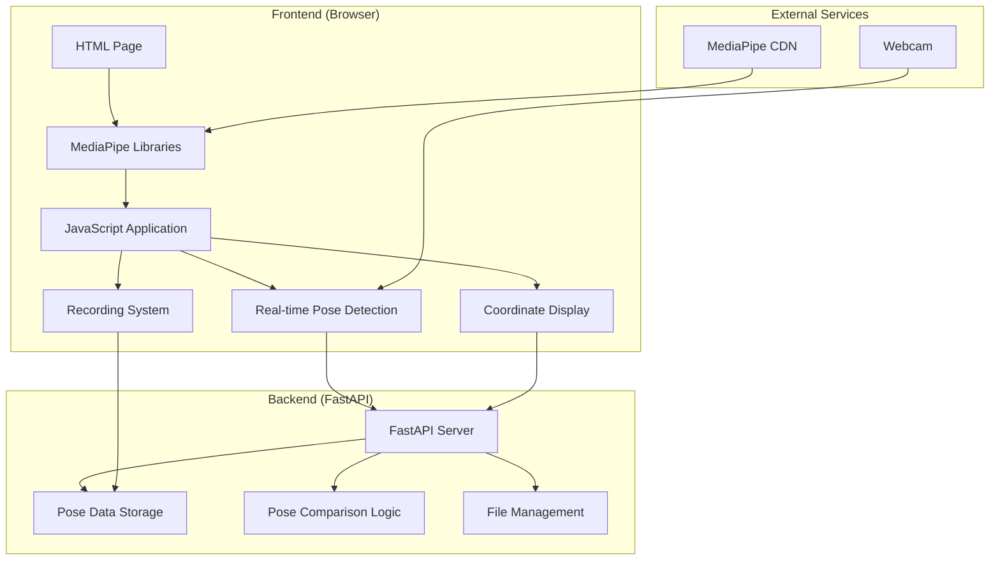
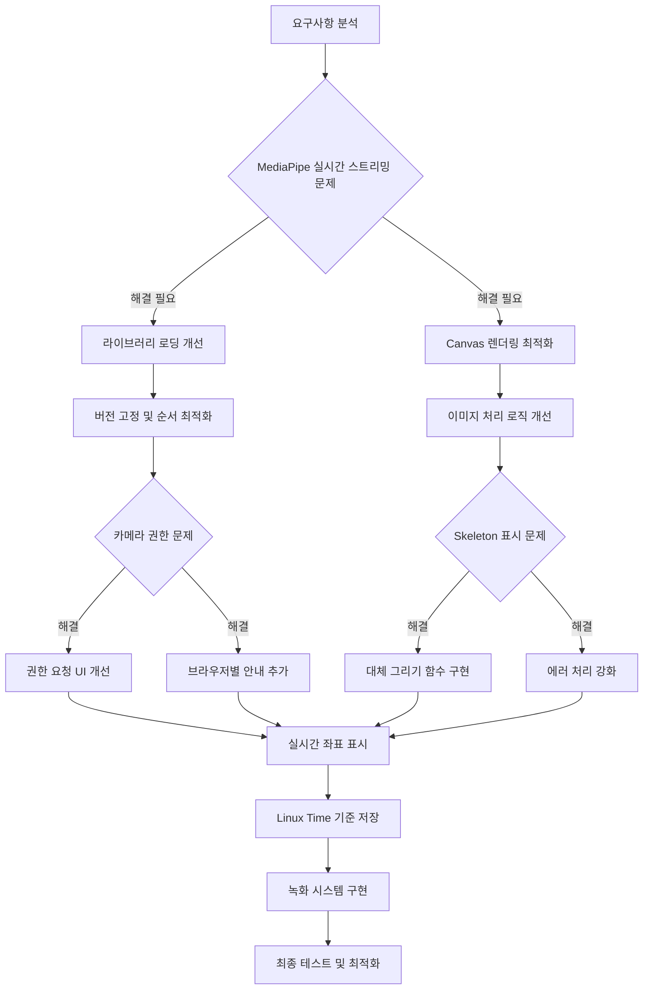
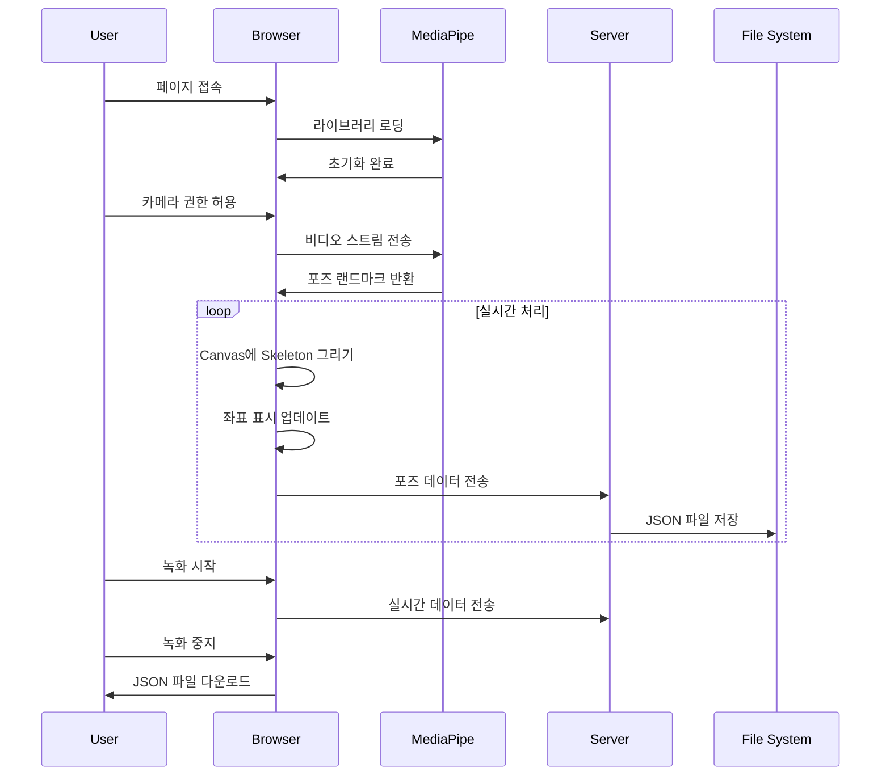
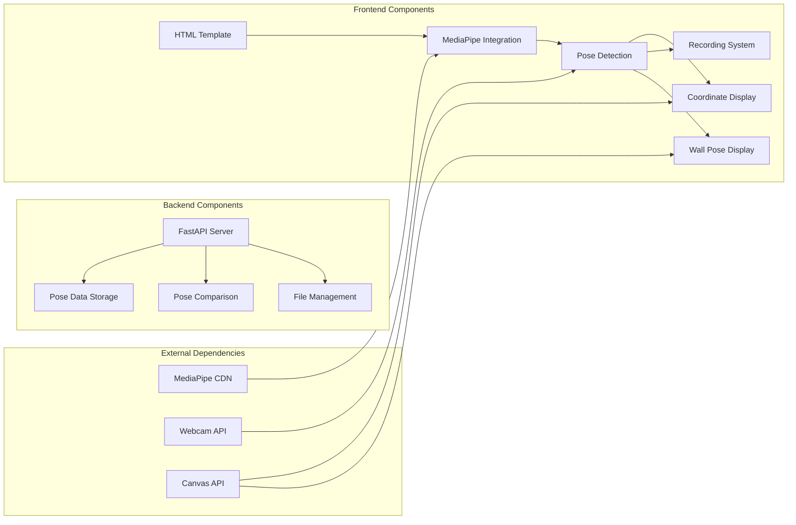
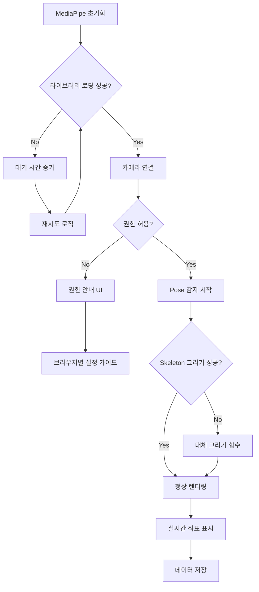
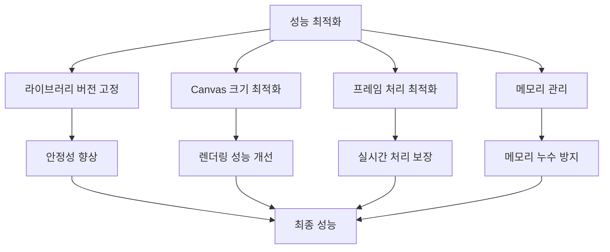

# MediaPipe Pose 게임 시스템 아키텍처

## 1. 전체 시스템 구조

```mermaid
graph TB
    subgraph "Frontend (Browser)"
        A[HTML Page] --> B[MediaPipe Libraries]
        B --> C[JavaScript Application]
        C --> D[Real-time Pose Detection]
        C --> E[Coordinate Display]
        C --> F[Recording System]
    end
    
    subgraph "Backend (FastAPI)"
        G[FastAPI Server] --> H[Pose Data Storage]
        G --> I[Pose Comparison Logic]
        G --> J[File Management]
    end
    
    subgraph "External Services"
        K[MediaPipe CDN] --> B
        L[Webcam] --> D
    end
    
    D --> G
    F --> H
    E --> G
```

## 2. 개발 플로우 및 의사결정 과정

```mermaid
flowchart TD
    A[요구사항 분석] --> B{MediaPipe 실시간 스트리밍 문제}
    B -->|해결 필요| C[라이브러리 로딩 개선]
    B -->|해결 필요| D[Canvas 렌더링 최적화]
    
    C --> E[버전 고정 및 순서 최적화]
    D --> F[이미지 처리 로직 개선]
    
    E --> G{카메라 권한 문제}
    F --> H{Skeleton 표시 문제}
    
    G -->|해결| I[권한 요청 UI 개선]
    G -->|해결| J[브라우저별 안내 추가]
    
    H -->|해결| K[대체 그리기 함수 구현]
    H -->|해결| L[에러 처리 강화]
    
    I --> M[실시간 좌표 표시]
    J --> M
    K --> M
    L --> M
    
    M --> N[Linux Time 기준 저장]
    N --> O[녹화 시스템 구현]
    
    O --> P[최종 테스트 및 최적화]
```

## 3. 데이터 플로우

```mermaid
sequenceDiagram
    participant U as User
    participant B as Browser
    participant M as MediaPipe
    participant S as Server
    participant F as File System
    
    U->>B: 페이지 접속
    B->>M: 라이브러리 로딩
    M->>B: 초기화 완료
    
    U->>B: 카메라 권한 허용
    B->>M: 비디오 스트림 전송
    M->>B: 포즈 랜드마크 반환
    
    loop 실시간 처리
        B->>B: Canvas에 Skeleton 그리기
        B->>B: 좌표 표시 업데이트
        B->>S: 포즈 데이터 전송
        S->>F: JSON 파일 저장
    end
    
    U->>B: 녹화 시작
    B->>S: 실시간 데이터 전송
    U->>B: 녹화 중지
    B->>U: JSON 파일 다운로드
```

## 4. 컴포넌트별 역할

```mermaid
graph LR
    subgraph "Frontend Components"
        A[HTML Template] --> B[MediaPipe Integration]
        B --> C[Pose Detection]
        C --> D[Coordinate Display]
        C --> E[Recording System]
        C --> F[Wall Pose Display]
    end
    
    subgraph "Backend Components"
        G[FastAPI Server] --> H[Pose Data Storage]
        G --> I[Pose Comparison]
        G --> J[File Management]
    end
    
    subgraph "External Dependencies"
        K[MediaPipe CDN]
        L[Webcam API]
        M[Canvas API]
    end
    
    K --> B
    L --> C
    M --> D
    M --> F
```

## 5. 에러 처리 및 복구 메커니즘

```mermaid
flowchart TD
    A[MediaPipe 초기화] --> B{라이브러리 로딩 성공?}
    B -->|No| C[대기 시간 증가]
    C --> D[재시도 로직]
    D --> B
    
    B -->|Yes| E[카메라 연결]
    E --> F{권한 허용?}
    F -->|No| G[권한 안내 UI]
    G --> H[브라우저별 설정 가이드]
    
    F -->|Yes| I[Pose 감지 시작]
    I --> J{Skeleton 그리기 성공?}
    J -->|No| K[대체 그리기 함수]
    J -->|Yes| L[정상 렌더링]
    
    K --> L
    L --> M[실시간 좌표 표시]
    M --> N[데이터 저장]
```

## 6. 성능 최적화 전략

```mermaid
graph TD
    A[성능 최적화] --> B[라이브러리 버전 고정]
    A --> C[Canvas 크기 최적화]
    A --> D[프레임 처리 최적화]
    A --> E[메모리 관리]
    
    B --> F[안정성 향상]
    C --> G[렌더링 성능 개선]
    D --> H[실시간 처리 보장]
    E --> I[메모리 누수 방지]
    
    F --> J[최종 성능]
    G --> J
    H --> J
    I --> J
``` 